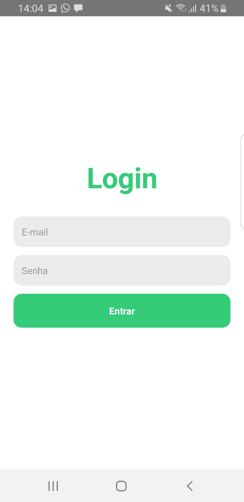
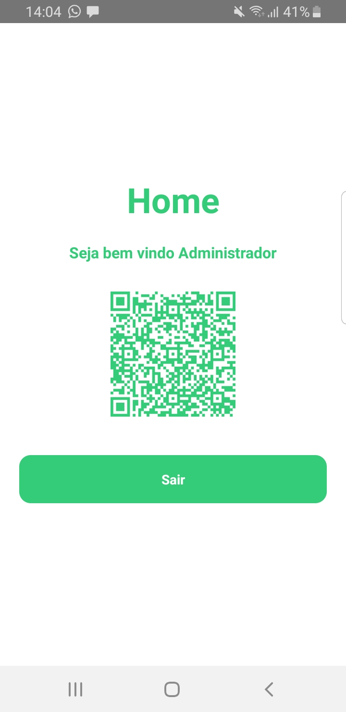

<h2 align="center">
 App Login + QRCode
</h2>
Um aplicativo em react native com login de autenticação utilizando context api persistindo os dados no async storage e qr code para leitura de dados.

### Ferramentas utilizadas:
- React Navigation;
- Context API;
- Async Storage;
- React Native QRCode SVG;
- Styled Components;
- Axios;
- Formik;

### Telas:

---

## Licença

Esse projeto está sob a licença MIT. Veja o arquivo [LICENSE](LICENSE) para mais detalhes.

<h4 align="center">
  <em>&lt;/&gt;</em> by <a href="https://github.com/brenoo2018" target="_blank">brenoo2018</a>
</h4>
